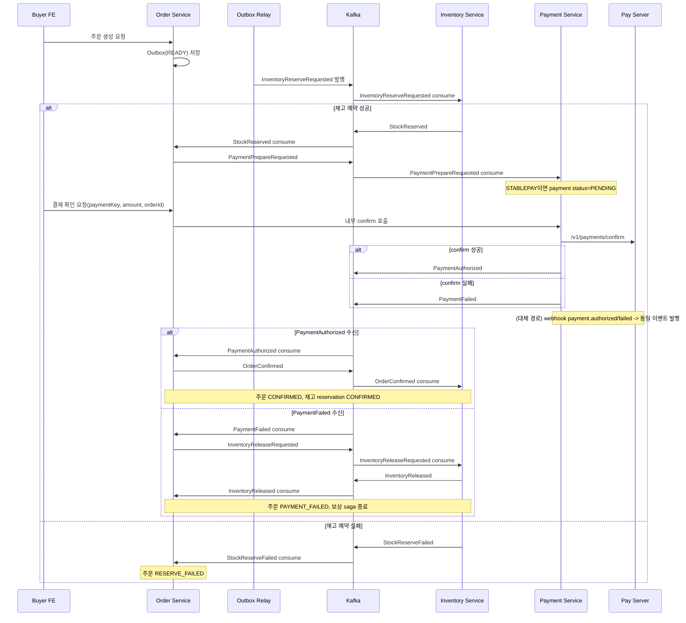
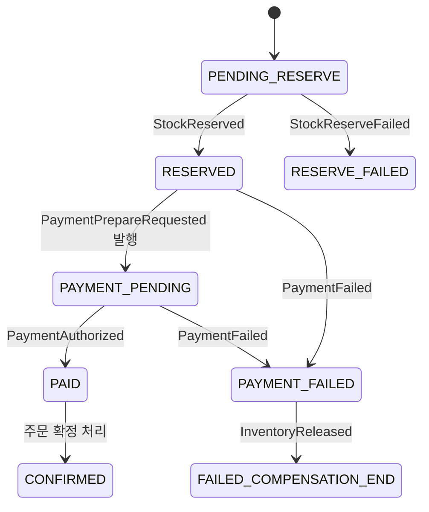

# 주문-결제 Kafka 이벤트/상태 정리 (현재 구현 기준)

작성일: 2026-03-19  
대상 코드: `order`, `payment`, `inventory`

## 1) 범위

- 주문 생성 이후 재고 예약/결제 준비/결제 성공-실패/보상까지의 이벤트 흐름
- Outbox/Inbox 상태 전이
- Kafka topic pub/sub와 consume 이후 도메인 상태 전이

---

## 2) Kafka Topic 맵

| Topic | 기본값 | Publish(Service) | Subscribe(Service) |
|---|---|---|---|
| `wearhouse.kafka.inventory-command-topic` | `wearhouse.inventory.command.v1` | order (`InventoryReserveRequested`, `InventoryReleaseRequested`) | inventory (`InventoryCommandConsumer`) |
| `wearhouse.kafka.inventory-event-topic` | `wearhouse.inventory.event.v1` | inventory (`StockReserved`, `StockReserveFailed`, `InventoryReleased`) | order (`OrderKafkaConsumer`) |
| `wearhouse.kafka.payment-prepare-topic` | `wearhouse.payment.command.v1` | order (`PaymentPrepareRequested`) | payment (`PaymentCommandConsumer`) |
| `wearhouse.kafka.payment-event-topic` | `wearhouse.payment.event.v1` | payment (`PaymentAuthorized`, `PaymentFailed`) | order (`OrderKafkaConsumer`) |
| `wearhouse.kafka.order-event-topic` | `wearhouse.order.event.v1` | order (`OrderConfirmed`) | inventory (`InventoryOrderConsumer`) |

참고:
- `order`의 `inventory-reserve-topic`과 `inventory-command-topic` 기본값은 둘 다 `wearhouse.inventory.command.v1`.

---

## 3) Outbox에서 발행되는 이벤트

### 3.1 order service

- `InventoryReserveRequested`: 주문 생성 직후 재고 예약 요청
- `InventoryReleaseRequested`: 결제 실패 보상/취소 시 재고 복원 요청
- `PaymentPrepareRequested`: 재고 예약 성공 후 결제 준비 요청
- `OrderConfirmed`: 결제 승인 확정 후 주문 확정 이벤트

참고:
- `OrderCreated` 상수는 존재하지만 현재 publish 호출은 없음.

### 3.2 inventory service

- `StockReserved`: 재고 예약 성공
- `StockReserveFailed`: 재고 예약 실패
- `InventoryReleased`: 재고 복원 완료

### 3.3 payment service

- `PaymentAuthorized`: 결제 승인 성공
- `PaymentFailed`: 결제 승인 실패

---

## 4) 이벤트 Consume 시 상태 전이

| Consumed Event | Consumer | 주요 전이 | 후속 발행 |
|---|---|---|---|
| `InventoryReserveRequested` | inventory | 재고 예약 성공 시 reservation `RESERVED`; 비즈니스 실패는 예외 대신 실패 이벤트로 전환 | `StockReserved` 또는 `StockReserveFailed` |
| `StockReserved` | order saga | 주문 `PENDING_RESERVE -> RESERVED -> PAYMENT_PENDING`, saga `WAITING_INVENTORY -> WAITING_PAYMENT_PREPARE -> WAITING_PAYMENT_RESULT` | `PaymentPrepareRequested` |
| `StockReserveFailed` | order saga | 주문 `PENDING_RESERVE -> RESERVE_FAILED`, saga `RESERVE_FAILED` | 없음 |
| `PaymentPrepareRequested` | payment | 결제 row 생성. `STABLEPAY`는 `PENDING` 유지 | (STABLEPAY는 없음, 일부 mock method는 `PaymentAuthorized`/`PaymentFailed`) |
| `PaymentAuthorized` | order saga | 주문 `PAYMENT_PENDING -> PAID -> CONFIRMED`, saga `CONFIRMED` | `OrderConfirmed` |
| `PaymentFailed` | order saga | 주문 `-> PAYMENT_FAILED`; 기존 상태가 `RESERVED`/`PAYMENT_PENDING`이면 보상 saga `COMPENSATING` | `InventoryReleaseRequested` |
| `InventoryReleaseRequested` | inventory | reservation `RESERVED -> RELEASED` | `InventoryReleased` |
| `InventoryReleased` | order saga | 결제실패 보상 종료, saga `FAILED` | 없음 |
| `OrderConfirmed` | inventory | reservation `RESERVED -> CONFIRMED` | 없음 |

추가 경로:
- pay webhook `payment.authorized`/`payment.failed` 수신 시 payment 서비스가 동일하게 `PaymentAuthorized`/`PaymentFailed`를 Kafka로 발행.

---

## 5) Outbox/Inbox 상태 모델

## 5.1 Outbox

- 공통 상태: `READY -> SUCCESS | FAIL`
- 저장 시점: 도메인 이벤트 `BEFORE_COMMIT`에 `READY` 저장
- 발행 시점: `Outbox Relay Scheduler`가 주기적으로 `READY/FAIL` 레코드를 조회해 Kafka publish 시도
- publish 성공: `SUCCESS`
- publish 실패: `FAIL` + reason 저장

## 5.2 Inbox

- 공통 상태: `RECEIVED -> PROCESSED | FAILED`
- `tryReceive`에서 `(eventId, consumer)` unique 충돌이면 중복으로 간주하고 skip
- Kafka consumer는 `ack-mode: manual_immediate`, `enable-auto-commit: false`로 설정
- Inbox 처리 성공(또는 중복 스킵) 후 `ack.acknowledge()` 수행, 예외 시 ack 없음(재처리)
- 전역 `DefaultErrorHandler` 적용: `FixedBackOff(retry-interval-ms, retry-attempts)` + `DeadLetterPublishingRecoverer`
- `ErrorException`, `IllegalArgumentException`은 non-retryable로 분류되어 즉시 DLT로 위임
- 정상 처리 시 `PROCESSED`
- 처리 중 시스템 예외 시 `FAILED`

주의:
- inventory의 `InventoryReserveRequested` 처리에서 비즈니스 예외(`ErrorException`)는 `FAILED`로 두지 않고 `StockReserveFailed`를 발행한 뒤 `PROCESSED`로 마감함.

## 5.3 재발행

- order/payment/inventory 모두 `OutboxRepublishBatchService` + `OutboxRelayScheduler`가 있음
- `@Scheduled(fixedDelay = wearhouse.outbox.republish-interval-ms, default 500ms)`로 relay가 동작함
- relay는 `READY`, `FAIL` 상태를 모두 대상에 포함함

---

## 6) Diagram

---

## 7) 코드 기준점

- order topic 설정: `order/src/main/resources/application.yml`
- payment topic 설정: `payment/src/main/resources/application.yml`
- inventory topic 설정: `inventory/src/main/resources/application.yml`
- order saga 전이: `order/domain/service/command/OrderSagaService`
- payment prepare/confirm/webhook: `payment/domain/payment/service/command/PaymentCommandService`, `PaymentWebhookService`
- inventory 예약/복원/확정: `inventory/domain/service/command/InventoryCommandService`
- outbox/inbox listener 및 producer: 각 서비스 `*OutboxRecordListener`, `*OutboxPublishListener`, `*KafkaProducer`, `*InboxRepository`
