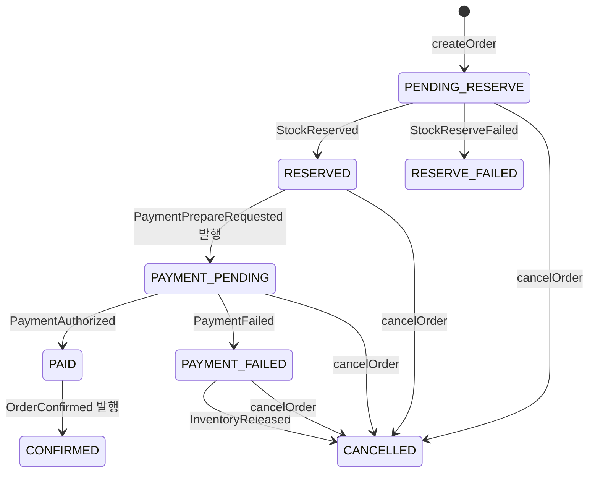
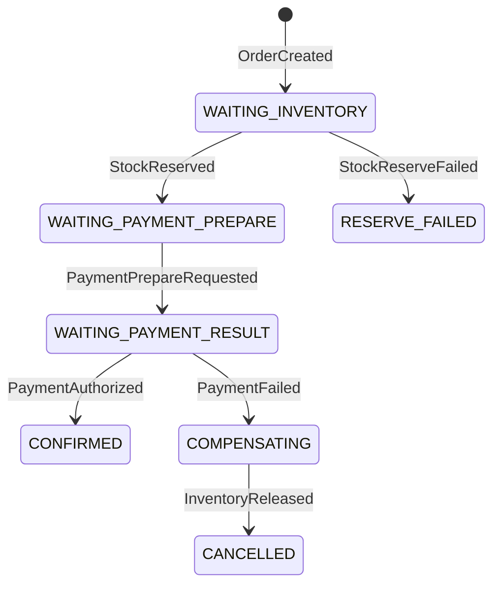
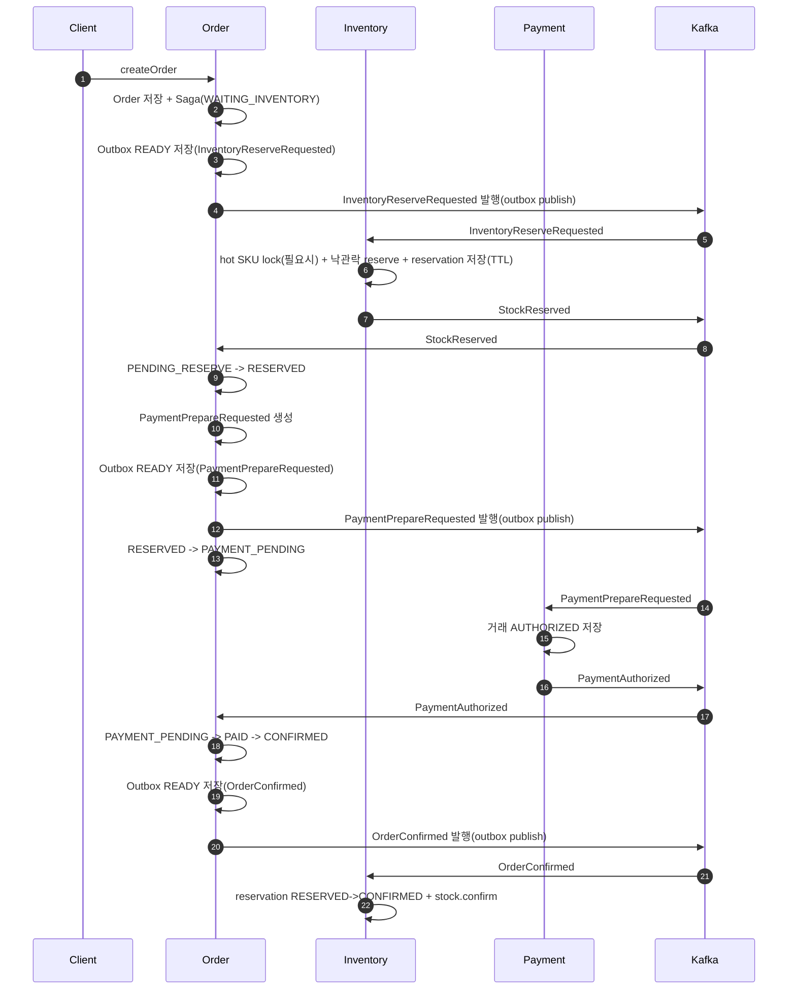
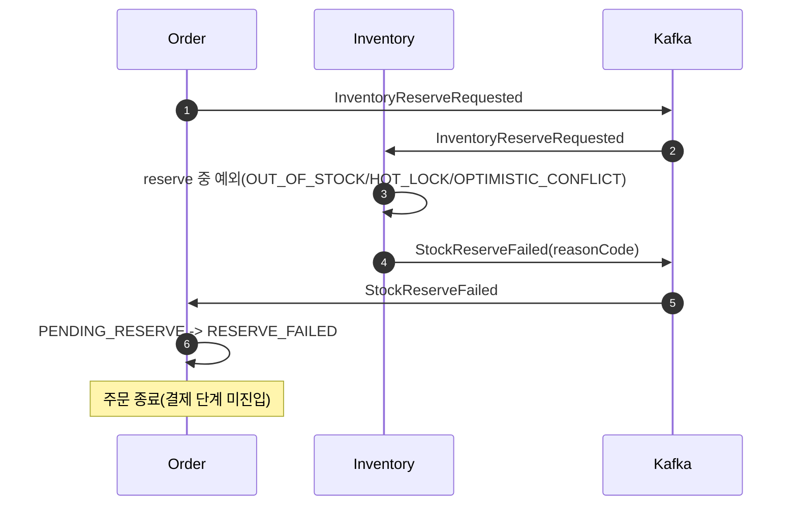
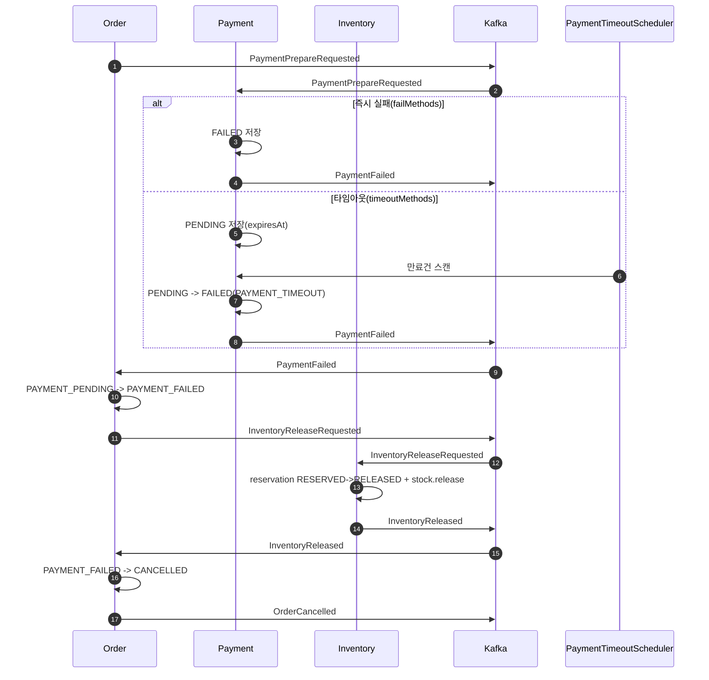

# Order-Inventory-Payment Saga Event Flow (As-Is)

기준일: 2026-03-08  
기준 코드: `order`, `inventory`, `payment` 모듈 현재 구현

## 1) 이벤트/토픽 맵

### Core Command/Event Types
- `InventoryReserveRequested` (order -> inventory)
- `StockReserved` (inventory -> order)
- `StockReserveFailed` (inventory -> order)
- `PaymentPrepareRequested` (order -> payment)
- `PaymentAuthorized` (payment -> order)
- `PaymentFailed` (payment -> order)
- `InventoryReleaseRequested` (order -> inventory)
- `InventoryReleased` (inventory -> order)
- `OrderConfirmed` (order -> inventory)
- `OrderCancelled` (order -> inventory 포함 타 서비스 구독 가능)

### Default Topics
- `wearhouse.inventory.command.v1`
- `wearhouse.inventory.event.v1`
- `wearhouse.payment.command.v1`
- `wearhouse.payment.event.v1`
- `wearhouse.order.event.v1`

## 2) 발행 신뢰성 모델

- `order`: Outbox 패턴 사용
  - BEFORE_COMMIT: outbox 저장 (`READY`)
  - AFTER_COMMIT: Kafka 발행 시도
  - 실패 시 `SEND_FAIL`/`DEAD` 전이 + 스케줄러 재발행
- `inventory`, `payment`: Outbox 없음
  - AFTER_COMMIT에서 직접 Kafka 발행
- `order`, `inventory`, `payment` 모두 Inbox(중복키)로 consumer 멱등 처리

## 3) 상태 다이어그램

### 3.1 Order Status

### 3.2 Order Saga State

## 4) 시퀀스 다이어그램

### 4.1 성공 시나리오 (Order -> Inventory -> Payment -> Order Success)

### 4.2 실패 시나리오 A: 재고 예약 실패

### 4.3 실패 시나리오 B: 결제 타임아웃/실패 + 보상

## 5) 실패 케이스 단계 분리(운영 관점)

1. `재고 단계 실패`
- 트리거: `InventoryReserveRequested` 처리 실패
- 이벤트: `StockReserveFailed`
- 최종 주문 상태: `RESERVE_FAILED`

2. `결제 승인 단계 실패`
- 트리거: Payment 즉시 실패(`failMethods`)
- 이벤트: `PaymentFailed`
- 최종 주문 상태: 보상 완료 후 `CANCELLED`

3. `결제 대기 타임아웃 실패`
- 트리거: Payment `PENDING` 만료 스케줄러
- 이벤트: `PaymentFailed(reasonCode=PAYMENT_TIMEOUT)`
- 최종 주문 상태: 보상 완료 후 `CANCELLED`

4. `보상 단계`
- 트리거: 주문이 `PAYMENT_FAILED` 상태에서 `InventoryReleaseRequested` 발행
- 이벤트: `InventoryReleased`
- 최종 주문 상태: `CANCELLED`

## 6) 구현상 주의 포인트

- 현재 `Order`만 outbox를 사용하므로, Inventory/Payment는 Kafka 발행 예외 시 트랜잭션 롤백/재처리 정책을 별도 검토해야 함.
- Inbox 멱등은 적용되어 있어 중복 소비 시 비즈니스 중복 처리를 방지함.
- Inventory 예약 만료 해제는 스케줄러 기반이며, 만료 해제 자체 이벤트는 현재 외부로 발행하지 않음(메트릭 증가만 수행).
